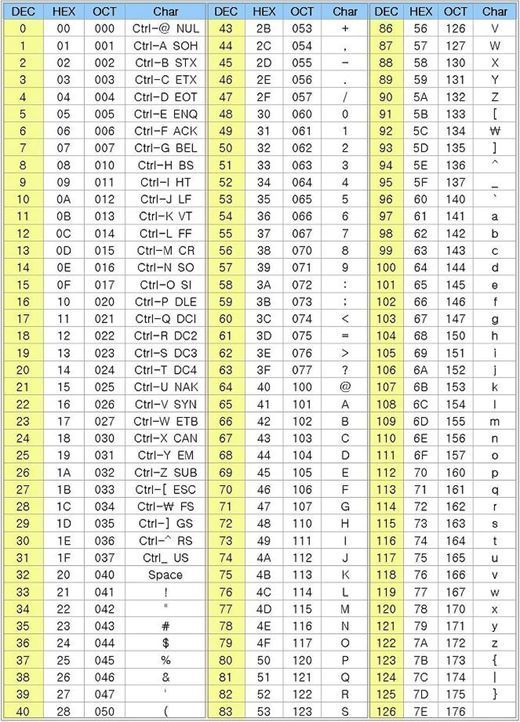

# Data Type

<pre>
  char : 1byte
  short  int : 2bytes
  int : 4 bytes
  long int : 8bytes
</pre>

```c
#include <stdio.h>

int main(void){
  printf("char = %lu bytes\n",sizeof(char));
  printf("short int = %lu bytes\n",sizeof(short int));
  printf("int = %lu bytes\n",sizeof(int));
  printf("long int = %lu bytes\n",sizeof(long int));
  
  return 0;
}
```

> Why we use HEX? => HEX represent 4bit

## char

> Smallest addressable unit of the machine

<pre>
  char : 1 byte : -2^8 to (2^7-1) => -128 to 127
  unsigned char : 1 byte : 0 to 2^8-1 => 0 to 255
</pre>

> Example

```c
#include <stdio.h>

int main(void){
  char a = -5;
  unsigned char b = 251;
  a = a-5;
	b = b-5;
  printf("%d %d\n",a, b);
  printf("%u %u\n",(unsigned char)a, b);
  
return 0; 
}
```

> ASCII code



> %c just change byte to character

## int

<pre>
  (signed) int : 4 bytes : -2,147,483,648 to 2,147,483,647
	unsigned int : 4 bytes : 0 to 4,294,967,295
	short (signed) int : 2 bytes : -32,768 to 32,767
	short unsigned int : 2 bytes : 0 to 65535
	long (signed) int : 8 bytes : -9,223,372,036,854,775,808 to 9,223,372,036,854,775,807
	long unsigned int : 8 bytes : 0 to 18,446,744,073,709,551,615
</pre>

