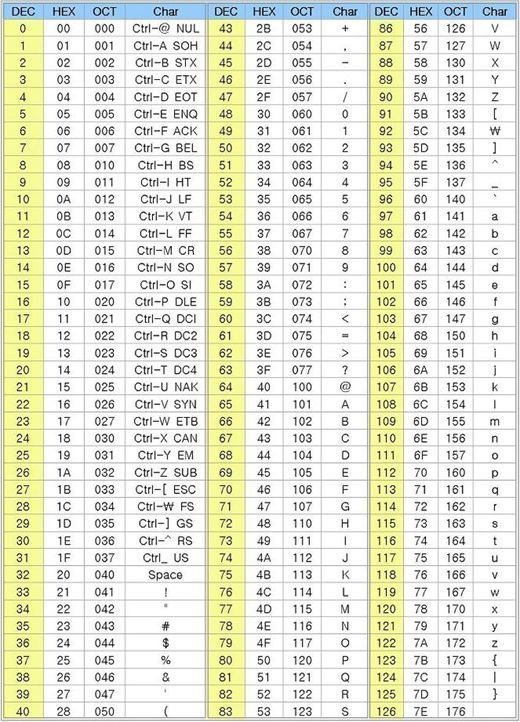

# Data Type

<pre>
  char : 1byte
  short  int : 2bytes
  int : 4 bytes
  long int : 8bytes
</pre>

```c
#include <stdio.h>

int main(void){
  printf("char = %lu bytes\n",sizeof(char));
  printf("short int = %lu bytes\n",sizeof(short int));
  printf("int = %lu bytes\n",sizeof(int));
  printf("long int = %lu bytes\n",sizeof(long int));
  
  return 0;
}
```

> Why we use HEX? => HEX represent 4bit

## char

> Smallest addressable unit of the machine

<pre>
  char : 1 byte : -2^8 to (2^7-1) => -128 to 127
  unsigned char : 1 byte : 0 to 2^8-1 => 0 to 255
</pre>

> Example

```c
#include <stdio.h>

int main(void){
  char a = -5;
  unsigned char b = 251;
  a = a-5;
	b = b-5;
  printf("%d %d\n",a, b);
  printf("%u %u\n",(unsigned char)a, b);
  
return 0; 
}
```

> ASCII code



> %c just change byte to character

## int

<pre>
  	(signed) int : 4 bytes : -2,147,483,648 to 2,147,483,647
	unsigned int : 4 bytes : 0 to 4,294,967,295
	short (signed) int : 2 bytes : -32,768 to 32,767
	short unsigned int : 2 bytes : 0 to 65535
	long (signed) int : 8 bytes : -9,223,372,036,854,775,808 to 9,223,372,036,854,775,807
	long unsigned int : 8 bytes : 0 to 18,446,744,073,709,551,615
</pre>

> But **char, int** data type cannotrepresent **“real number”**

## floating point

> floating point
>
> - Single  precision
>   - 3002bit (4bytes)
>   - 1bit(sign) + 8bit(exponent) + 23bit(mantisa)
> - double precision
>   - 64bit (8bytes)
>   - 1bit(sign) + 11bit(exponent) + 52bit(mantisa)


> Example

<pre>
  10.625 = 2^3 + 2^1 + 2^-1 +2^-3
  --> 1010.101
</pre>

> 10.625(decimal) =1010.101(binary)
>
> Normalization 1010.101 (10.625)

<pre>
  10.625 --(normalization)--> 1.0625 * 10^1
  1010.101 --(normalization)--> 1.010101 * 2^3
</pre>

> 1.010101*2^3 = 10.625(decimal)
>
> Sign bit : 0
>
> Exp - bias = 3
>
> man = 010101

<pre>
  bias = (2^n-1)-1	// n is exponent bit num
  3 = Exp-((2^8-1)-1) = Exp - 127 (float case)
  Exp = 130
</pre>

> 1.010101*2^3 = 10.625(decimal)
>
> Sign bit : 0
>
> Exp : 10000010
>
> man : 010101 ( All remaining bits on the right are 0 )

<pre>
  0 10000010 01010100000000000000000
  = 10.625
</pre>

> But 0.01 cannot be represented completely with 23 bits of mantissa. 
>
> As an approximation, 0.01 * 100 != 1.0


