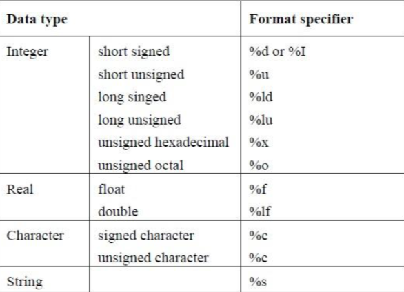

# Constants

> C language has three type of constants
>
> - Symbolic Constants
> - define preprocessor
> - Literal Constants

## Symbolic Constants

> Use keyword 'const' then u can make constant

```c
#include <stdio.h>
int main(void) {
  
  const int LENGTH = 10;
  const int WIDTH = 5;
  const char NEWLINE = '\n';
  int area;
  
  area = LENGTH * WIDTH;
  printf("value of area : %d", area);
  printf("%c", NEWLINE);
  
  return 0; 
}
```

## define preprocessor

>  Use keyword '#define' then u cna make constant

```c
#include <stdio.h>
#define LENGH 10
#define WIDTH 5
#define NEWLINE '\n'

int main(void) {
  int area;
  
	area = LENGTH * WIDTH;
	printf("value of area : %d", area);
	printf("%c", NEWLINE);
  
	return 0; 
}
```

> define proprocessor is __not use memory__
>
> In preprocessing, code will change

```c
#include <stdio.h>

int main(void) {
  int area;
  
	area = 10 * 5;
	printf("value of area : %d", area); 
  printf("%c", '\n');
  
	return 0;
}
```

## Literal Constants

> Integer Literals
>
> - An integer literal can be 
>   - a decimal 
>   - octal (prefix 0) 
>   - or hexadecimal (prefix 0x or 0X ) 
> - Can have a suffix that is a combination of U and L, for unsigned and long, respectively. The suffix can be uppercase or lowercase and can be in any order. 

<pre>
  85 -> decimal
  0213 -> octal
  0x4b -> hexadecimal
  30 -> int
  30u -> unsigned int
  30l -> long
  30ul -> unsigned long
</pre>

> Character literals
>
> - Character literals are enclosed in single quotes, e.g., 'x' can be stored in a simple variable of **char** type. 
>
> -  A character literal can be a plain character (e.g., 'x') or an escape sequence (e.g., '\t') 

---

> String literals 
>
> - String is the “Array of characters”, ends with NULL (‘\0’) character 
>
> -  String literals or constants are enclosed in double quotes "". 
>
>   ```c
>              "hello, dear"
>   ```
>
>   ```c
>              "hello, \
>              dear"
>   ```
>
>   ```c
>              "hello, " "d" "ear"
>   ```

# printf & scanf

> Formatted printf()

```c
int some_number = 3;   
printf("some_number = %d\n", some_number);
```

> Format specifiers



---

> Formatted scanf()

```c
int some_number;
scanf("%d", &some_number)
```

> Example

```c
#include <stdio.h>
int main(void){
  int some_number;
  
  scanf("%d", &some_number); 	
  printf("some_number = %d\n", some_number); 

	return 0;
} 
```

# Operator

> Operators 
>
> - Arithmetic Operators 
> - Relational Operators 
> - Logical Operators 
> - Bitwise Operators 
> - Assignment Operators  
> - Misc Operators 

---

> Arithmetic operator


```c
int a = 100, b = 23;
int c;

c = a+b; //c = 123
c = a-b; // c = 77
c = a/b; // c = 4
c = a%b // c = 8
c = a++; // c = 101 --> 100
c = b--; // c = 23

c = -a; // c = -100
```

---

> Pre/post increment/decrement operator
>
> - ++ or --

```c
int a = 100, b = 23;
int c;

c = ++a; //c = 101, a = 101
c = a++; //c = 101, a = 102
c = --a; //c = 101, a = 101
c = a--; //c = 101, a = 100
```

---

> Relational operator


```c
int a = 100, b = 23;
int c;

c = (a==b); //c=0(false)
c = (a!=b); //c=1(true)
c = (a>b); //c=1(true)
c = (a<b); //c=0(false)
c = (a>=b); //c=1(true)
c = (a<=b); //c=0(false)
```

---

> Logical operator


```c
int a = 1, b = 0;
int c;

a&&b //false
a||b //true
!a //false
!b; //true

c = ((a>b) && (a!=b));
c = !(a==b);
```

---

>  Bitwise operation


```c
unsigned char a=100, b=23;
unsigned char c;

c = a&b; //01100100 & 00010111 AND
c = a|b; //01100100 | 00010111 OR
c = a^b; //01100100 ^ 00010111 XOR
c = ~a; //01100100 -> 10011011 NOT
c = b<<3; //00010111 -> 10111000 SHIFT (Left)
c = a>>2; //01100100 -> 00011001 SHIFT (Right)
```

---

