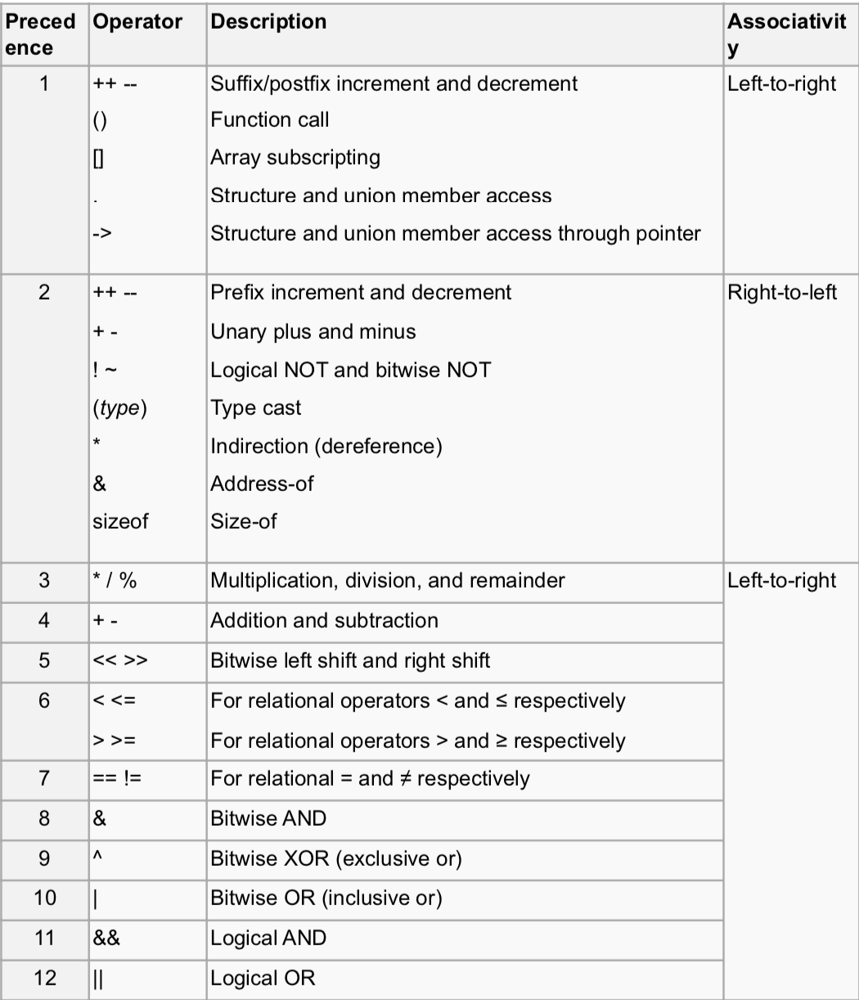
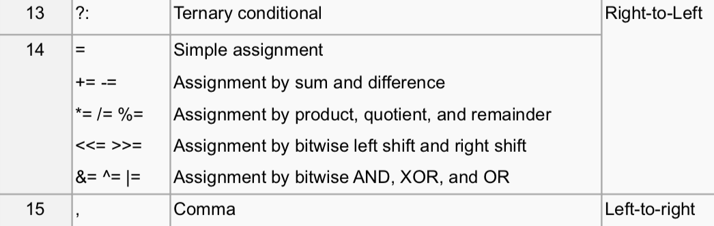

# Operator precedence





---

```c
int i,j;
i=2 && (j=2); // i = 1, j = 2
(i=0) && (j=3); // i = 0, j = 2
i=0 || (j=4); // i = 1, j = 4
(i=2) || (j=5); // i = 2, j = 4
```

---

# if

```c
if (exp)
  //statment
```

>If *exp* is nonezero (true), then *statement* is executed; otherwise, *statement* is skipped.

# if-else

```c
if (exp)
  //statement1
else
  //statement2
```

>If *exp* is nonezero (true), then *statement1* is executed and *statement2* is skipped; If *exp* is zero (false), then *statement2* is executed.

# if-else(nested)

```c
if(exp){
    statement1;
}
else if(exp) {
    statement2;
}
else if(exp) {
    statement3;
}
```

# while

```c
while (exp)
  //statement
//next statement  
```

>If *exp* is nonezero (true), then *statement* is executed and control is passed back to the beginning of while loop. while loop executed repeatedly until *exp* is zero(false).

```c
int i=1, sum=0;
while (i<=10){
  sum += i;
  printf("i=%d, sum = %d\n", i, sum);
  i++;
}
```